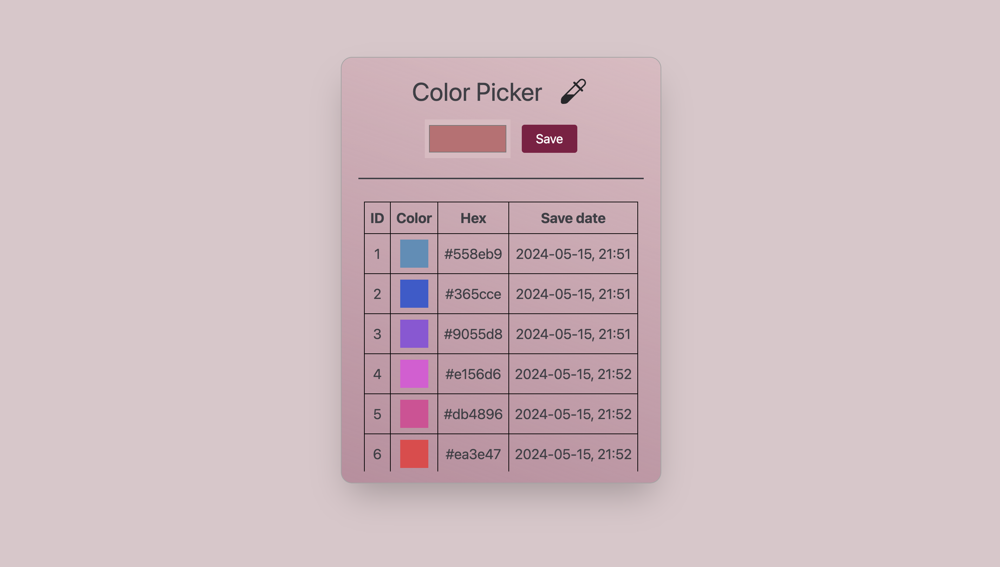

#  Color Picker

   
   
  

## Welcome!

This is responsive Color Picker app created using React, Tailwind, Css, localStorage.

🔹 Preview - <a href="https://simonakom.github.io/color-picker/build/index.html">here</a>

## Getting Started

Follow these instructions to get a copy of the project up and running on your local machine for development and testing purposes.

### Prerequisites

Before you begin, ensure you have the following installed on your machine:

- Node.js: [Download here](https://nodejs.org/)
- npm (Node Package Manager): Comes with Node.js installation

### Installation

1. Clone this repository to your local machine
2. Navigate to the project directory
3. Install tailwind
4. Install dependencies: `npm install`
5. Install React Icons: `npm install react-icons`
6. Once the dependencies are installed, you can start the development server and run the app: `npm start`

### Viewing the App

The app will be available at your default web browser at http://localhost:3000.

### License
This project is licensed under the MIT License - see the LICENSE file for details. Intention is that you can use everything in this project as a starting point or as a bits and pieces in your own project.

Hope you find this project interesting and useful!

  

